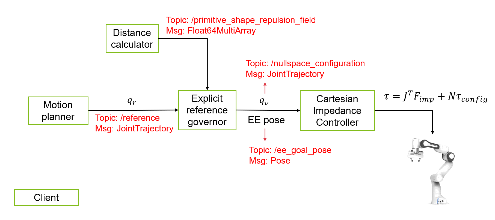

# Real-time path planning for human-robot collaboration

## Description
Note: Right now, the code only works with a real robot.\
Here is the overview of the system.

The figure shows how each node interact with each other.
* `motion_planner` node is a sampling-based global planner. Right now, you can send a goal pose to the
  node via command line interface when starting the node.
  ```
  ros2 run motion_planning_mt motion_planner --ros-args -p <parameter_name>:=<value> 
  ```
  There are five paramaeters you can set:
  1. `goal_positions`: \
   Goal positions in Cartesian space. It should be provided to the node as a list of double. For example, [x, y, z, x, y, z, ...]. The default value is [0.5, 0.0, 0.6].
  2. `goal_orientations`: \
   Goal orientations in quaternion. It should be provided to the node as a list of double. For example, [x, y, z, w, x, y, z, w, ...].The default value is [1.0 , 0.0, 0.0, 0.0].
  3. `set_goal_pose`: \
   whether to set the goal pose. The default value is `false`.
  4. `seed`: \
   The seed controls the goal position when you didn't set your own goal pose. The default value is 1.
  5. `num_of_rounds`: \
   Number of goal poses that the motion planner will plan for. If `num_of_rounds` is 3. There should be 9 numbers in `goal_positions` and 12numbers in `goal_orientations`. The default value is 1.
* `distance_calculator` node calculates the repulsion field based on the closest distance between obstacles and the robot.
* `explicit_reference_governor` node is a potential field based local planner. It receives all the information and generates
  the final command that is sent to the Cartesian impedance controller.
* `cartesian_impedance_controller` node calculates the required torque that is a combination of:
  1. Impedance force that controls the end-effector behavior.
  2. Nullspace torque that controls the configuration of the robot.

## Installtion steps
### MoveIt
Install [Moveit Humble](https://moveit.picknik.ai/humble/doc/tutorials/getting_started/getting_started.html).
Follow the installtion steps there.\
Here is also a copy of the command. * We name our workspace `franka_ros2_ws`, which is
different from [Moveit Humble](https://moveit.picknik.ai/humble/doc/tutorials/getting_started/getting_started.html).
```
source /opt/ros/humble/setup.bash
```
```
sudo apt install python3-rosdep
```
```
sudo rosdep init
rosdep update
sudo apt update
sudo apt dist-upgrade
```
```
sudo apt install python3-colcon-common-extensions
sudo apt install python3-colcon-mixin
colcon mixin add default https://raw.githubusercontent.com/colcon/colcon-mixin-repository/master/index.yaml
colcon mixin update default
```
```
sudo apt install python3-vcstool
```
```
mkdir -p ~/franka_ros2_ws/src
```
```
cd ~/franka_ros2_ws/src
git clone --branch humble https://github.com/ros-planning/moveit2_tutorials
```
```
vcs import < moveit2_tutorials/moveit2_tutorials.repos
```
```
sudo apt update && rosdep install -r --from-paths . --ignore-src --rosdistro $ROS_DISTRO -y
```
```
cd ~/franka_ros2_ws
colcon build --mixin release
```
If you are short on computer memory or generally your build is struggling to complete on your computer, 
you can append the argument `--parallel-workers [num of workers]` to the colcon command above.
```
source install/setup.bash
```

### Franka ROS2
We install the **v0.1.13** of franka ros2. The installation steps based on [franka_ros2](https://github.com/frankaemika/franka_ros2/blob/humble/README.md)
has been modified a little bit to install the specific version.
```
sudo apt install -y \
ros-humble-ament-cmake \
ros-humble-ament-cmake-clang-format \
ros-humble-angles \
ros-humble-ros2-controllers \
ros-humble-ros2-control \
ros-humble-ros2-control-test-assets \
ros-humble-controller-manager \
ros-humble-control-msgs \
ros-humble-control-toolbox \
ros-humble-generate-parameter-library \
ros-humble-joint-state-publisher \
ros-humble-joint-state-publisher-gui \
ros-humble-moveit \
ros-humble-pinocchio \
ros-humble-realtime-tools \
ros-humble-xacro \
ros-humble-hardware-interface \
 ros-humble-ros-gz \
python3-colcon-common-extensions
```
```
source /opt/ros/humble/setup.bash
cd ~/franka_ros2_ws
git clone https://github.com/frankaemika/franka_ros2.git src/franka_ros2
```
```
cd src/franka_ros2/
git checkout v0.1.13
cd ~/franka_ros2_ws
colcon build --cmake-args -DCMAKE_BUILD_TYPE=Release 
source install/setup.sh
```

### Cartesian Impedance Controller

Clone the modified [Cartesian impedance Controller](https://github.com/ptliu268/cartesian_impedance_control) (forked from Curdin).
```
cd src/franka_ros2/src
git clone https://github.com/ptliu268/cartesian_impedance_control.git
git clone https://github.com/CurdinDeplazes/messages_fr3.git
cd src/franka_ros2
```
Add cartesian impedance controller to the config file located inside  `franka_moveit_config` package.\
Path to the file: `franka_ros2/franka_moveit_config/config/panda_ros_controllers.yaml`
```
cartesian_impedance_controller:
    type: cartesian_impedance_control/CartesianImpedanceController
```
Also in the `franka_moveit_config` package, modify the `moveit.launch.py` launch file:
1. Add two more key-value pair to the variable `planning_scene_monitor_parameters`.
  ```python
  planning_scene_monitor_parameters = {
    'publish_planning_scene': True,
    'publish_geometry_updates': True,
    'publish_state_updates': True,
    'publish_transforms_updates': True,
    'publish_robot_description' : True,
    'publish_robot_description_semantic' : True,
  }
  ```
2. Load cartesian impedance controller instead of panda_arm_controller.
  ```python
  # Load controllers
  load_controllers = []
  for controller in ['joint_state_broadcaster','cartesian_impedance_controller']: # instead of panda_arm_controller
      load_controllers += [
          ExecuteProcess(
              cmd=['ros2 run controller_manager spawner {}'.format(controller)],
              shell=True,
              output='screen',
          )
      ]
  ```
Build and source
```
colcon build --cmake-args -DCMAKE_BUILD_TYPE=Release 
source install/setup.sh
```
### Motion planner
Lastly, clone this project and build.
```
cd ~/franka_ros2_ws/src
git clone https://github.com/ptliu268/motion_planning_mt.git
cd ~/franka_ros2_ws
colcon build --cmake-args -DCMAKE_BUILD_TYPE=Release
```

## How to run the demo code
Note: Right now, the code only works with a real robot.

After sourcing the workspace, change the working directory to `motion_planning_mt`
```
cd src/motion_planning_mt
```
Launch the moveit environment and the Cartesian impedance controller.
```
ros2 launch franka_moveit_config moveit.launch.py robot_ip:=<fci-ip>
```

To visualize the obstacles and the minimum distance in RViz, add two ROS2 topics. In displays panel, click "Add" button on the lower left corner.
   1. Add one MarkerArray, set the topic to which it subscribes to `/rviz_visual_tools` (If not yet subscribes).
   2. Add one MarkerArray, set the topic to which it subscribes to `/minimum_distance_visualization`.

Run the demo scene node, which populates three moving boxes.
```
ros2 run motion_planning_mt demo_scene
```

Run the distance calculator node, which visualize the distance between the closest obstacle to the robot.
```
ros2 run motion_planning_mt distance_calculator
```

Run the local planner node.
```
ros2 run motion_planning_mt explicit_reference_governor
```

Run the global planner node. * Be sure you are at the root folder of `motion_planning_mt`.
```
ros2 run motion_planning_mt motion_planner --ros-args --params-file demo/repeat_demo.yaml
```
